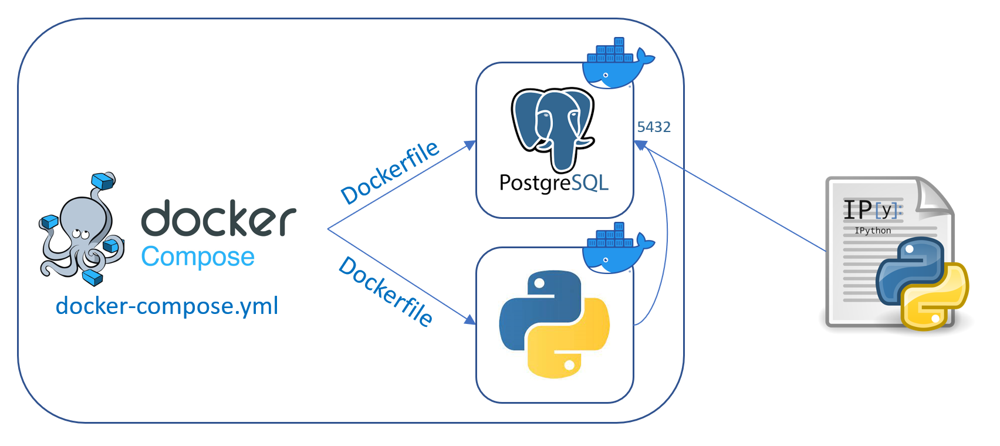
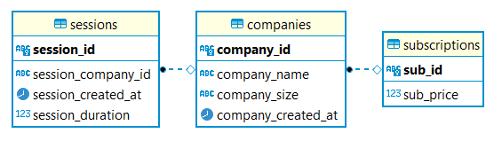

# Startup data generation and analysis

## Introduction
To create this project the below steps were followed:
1. Setting up a PostgreSQL database.
2. Populate the database with fake data representing the customer base of the startup.
3. Report 3 relevant KPIs of business health.

## Data generation
For the generation of fake data the following criteria was taken into account:
- Let’s assume our startup has existed for 12 months, we acquired all their customers on month 1 and we will not gain
any more customers in the following 12 months.
- All customers (referred to as companies) have monthly subscriptions.
- Create 500 companies, each with a unique `company_id`.
- Each company has a `company_size=“small”` with a probability of 0.7, and `“large”` with a probability of 0. 3.
- Monthly subscriptions for small and large companies are $19 and $99 respectively.
- Each small company has the number of sessions in a month equal to 5, plus or minus a uniform random integer between 0 & 5.
- Each large company has the number of sessions in a month equal to 10, plus or minus a uniform random integer between 0 & 10.
- Give each session a random `created_at` timestamp within that month.
- If a company has 0 sessions in a month, they have churned that month and will not come back (i. e. have no future sessions).

## Docker and Docker Compose

On this project, the Docker Compose is used to run 2 docker containers. One is for the PostgreSQL database and the other one is used to run the Python script that generates and populats the database with fake data based on the previous criteria.



## Database

The database is hosted on the __database__ docker container and it runs on a PostgreSQL database. The tables are created on the __app/app.py__ script that runs from the __app__ docker container.



## Instructions

To run this project you need to follow the next steps:

1. Before running the project you have to make sure you have installed Docker, Docker Compose (2.1 or higher) and Python3.
2. To start the 2 docker containers you have to write on the terminal: 
   ```sh
   docker-compose up --build
   ```
3. Once the 2 docker containers have been deployed, the __app__ container will stop when the generation of the data has finalized. The __database__ container will keep working.
4. You have to install the python libraries used on the analysis with the following command on the terminal:
   ```sh
   pip install -r requirements.txt
   ```
5. Open the _analysis.ipynb_ with your favorite editor and run all the cells.
